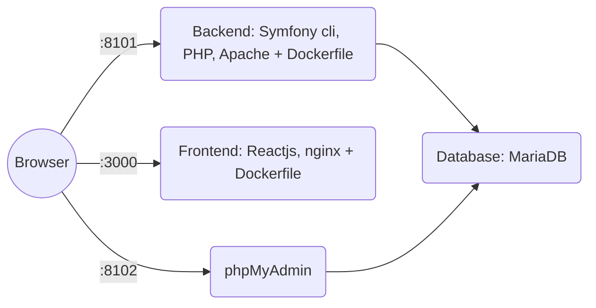

# docker-reactjs-symfony-cli-mariadb

4 containers:

The port displayed here are the default one in the .env file. 

## Getting Started

 1. Clone the repo.
 2. Review .env and update passwords, project name, ...
 3. Update apache site.conf (see below Apache site.conf).
 4. Build  `docker-compose build --pull --no-cache`
 5. Start all containers in background `docker-compose up -d`
 6. Check if the containers are running: `docker-compose ps`. It should looks like this:

|NAME             |COMMAND   |SERVICE  | STATUS | PORTS|
|-----------------|----------|---------|--------|------|
|PROJECT_NAME-db|"docker-entrypoint.s…" |db_server | running (healthy) | 0.0.0.0:33017->3306/tcp|
|PROJECT_NAME-db-admin |"/docker-entrypoint.…" |db_admin | running | 127.0.0.1:8102->80/tcp|
|PROJECT_NAME-frontend |"docker-entrypoint.s…"|frontend| running | 127.0.0.1:3000->3000/tcp |
|PROJECT_NAME-server |"docker-php-entrypoi…"|server| running | 127.0.0.1:8101->80/tcp |

 7. ssh to the backend server to create your symfony app.
 
 
## Directories structure
```markdown
├── /
├── .env
├── docker-compose.yml
├── docker/
│   ├── db/
│   │   ├── mariadb/
|   │   │   ├── my.cnf
│   ├── frontend/
│   │   ├── .dockerignore
│   │   ├── Dockerfile
│   │   ├── codebase/
|   │   │   ├── (Reactjs app)
│   │   ├── nginx/
|   │   │   ├── nginx.conf
│   ├── server/
│   │   ├── apache/
|   │   │   ├── sites-enabled/
|   |   │   │   ├── site.conf
│   │   ├── codebase/
│   │   ├── php/
|   │   │   ├── php.ini
```

## Frontend container: frontend

A basic Reactjs app already exists (created with ```
npx create-react-app .
``` ) and is running here :  `http://127.0.0.1:<APP_FRONTEND_PORT>` or `http://localhost:<APP_FRONTEND_PORT>`
APP_FRONTEND_PORT is defined in the .env file.

SSH into the container : `docker-compose exec frontend bash` 

## Backend container: server

SSH into the container : `docker-compose exec backend bash` 
Symfony cli is available to start a new Symfony project:

**Light  for API, microservices :**

   ```
symfony new <PROJECT_NAME_LOWERCASE>
or symfony new <PROJECT_NAME_LOWERCASE> --version="x.x.*"
```

**or full framework :**   
   ```
symfony new my_project_directory --webapp
or symfony new my_project_directory --webapp --version="x.x.*"
```

**Apache site.conf**
Replace <PROJECT_NAME_LOWERCASE> by the value defined in the .env file.
```
<VirtualHost *:80>
DocumentRoot /var/www/html/<PROJECT_NAME_LOWERCASE >/public
SetEnvIf Authorization "(.*)"  HTTP_AUTHORIZATION=$1
<Directory /var/www/html/<PROJECT_NAME_LOWERCASE>/public>
AllowOverride None
Order Allow,Deny
Allow from All

<IfModule mod_rewrite.c>
Options -MultiViews
RewriteEngine On
RewriteCond %{REQUEST_FILENAME} !-f
RewriteRule ^(.*)$ index.php [QSA,L]
</IfModule>
</Directory>
</VirtualHost>
```
PROJECT_NAME_LOWERCASE is the one set inthe  .env file 

Open  `http://127.0.0.1:<APP_BACKEND_PORT>` or `http://localhost:<APP_BACKEND_PORT>`
APP_BACKEND_PORT is defined in the .env.


## DB container
SSH into the container : `docker-compose exec db_server bash`
Then login to the database : `mariadb -u<DB_USER> -p`
The password is <DB_PASSWORD> in the .env file.

## DB admin container

Open `http://127.0.0.1:<APP_DB_ADMIN_PORT>`
And sign in with <DB_USER> and <DB_PASSWORD>

APP_DB_ADMIN_PORT, DB_USER and DB_PASSWORD are defined in the .env file.

## Stop containers

    docker-compose stop
